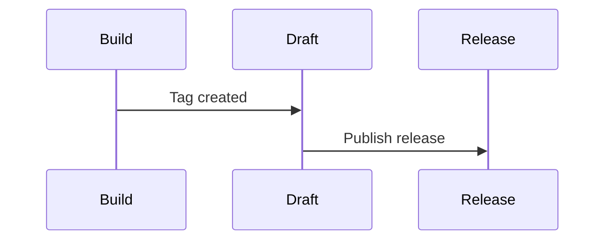

# CI Workflows

## Overview

- [Build](build.yml)
  - Build and test Haskell code
  - Build Docker image
- [Draft](draft.yml)
  - Create a GH draft release with a static binary
- [Release](release.yml)
  - Upload the Docker image ghcr.io
  - Upload the package and docs to Hackage

## Events

